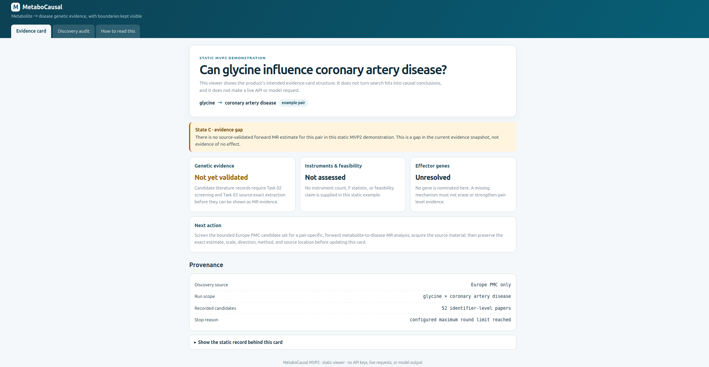
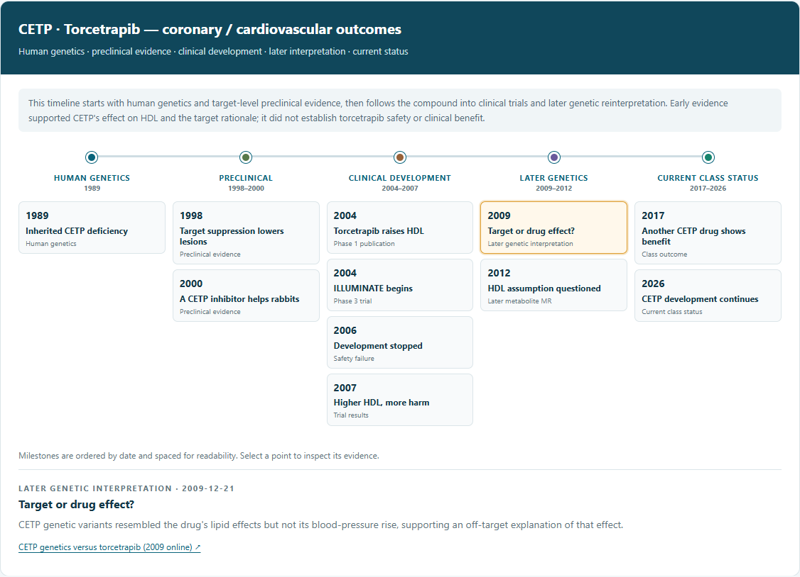

# MetaboCausal

MetaboCausal is a public demo repository for a hackathon project built by the MetaboCausal team at AI Tinkerers Montreal.

The project explores a simple product idea:

> Ask a metabolite-disease question in Slack. Get a source-linked evidence card that shows what is known, what is missing and what the team should check next.

This repository is intentionally **not** the full private development repository. It shares the product concept, public-safe screenshots and static demos so people can understand the design without exposing private data, API keys, raw search logs or the full internal literature workflow.

## Why this exists

Metabolomics can surface many molecules associated with disease, but association is not enough for drug discovery. A team still needs to ask:

- Is the molecule likely part of a causal path?
- Is it only a marker of disease or treatment?
- Is there enough evidence to design the next analysis?
- Which evidence is missing?

MetaboCausal is designed to keep those boundaries visible.

## What the prototype does

The prototype follows this product logic:

1. **Ask a question.** A user starts from a molecule and a disease.
2. **Trace public evidence.** The system resolves names and gathers available evidence from genetic, literature, target and clinical sources.
3. **Classify the evidence state.** The output distinguishes retrieved evidence, analysis-ready gaps and missing evidence.
4. **Return a checkable card.** The answer links back to source records and keeps uncertainty visible.
5. **Discuss in Slack.** The team sees a compact answer where the discussion is already happening.

The most important product rule is:

> "Not found" must not become "no effect."

A missing record is reported as a gap, not as a negative biological conclusion.

## Demo materials

| Demo | What it shows |
| --- | --- |
| [Static evidence-card demo](demo/evidence-card/index.html) | A public-safe HTML example showing an evidence gap, provenance and next action. |
| [Genetic timeline image](docs/assets/cetp-timeline.png) | A saved example of how dated genetic, preclinical and clinical evidence can be kept separate. |
| [5-minute presentation deck](presentation/MetaboCausal_5min_presentation.pptx) | The live-room presentation deck used to explain the project. |
| [Project blog](https://shuchengcaoxin.github.io/blog/metabocausal/) | Public narrative, roadmap and team context. |

## Screenshots

### Evidence card

### Example genetic timeline

## Evidence states

MetaboCausal uses practical evidence states rather than a single overconfident verdict.

| State | Meaning | Product behavior |
| --- | --- | --- |
| A. Retrieved evidence | Existing genetic evidence was found for the pair. | Show the source-linked result and its limitations. |
| B. Analysis-ready | Required input data appear available, but the exact analysis was not found. | Show what can be run next. |
| C. Evidence gap | The current evidence snapshot does not support a result. | Report the gap clearly and preserve the search boundary. |

These states describe evidence availability. They do not prove that a drug will work.

## What is public here

This public repository includes:

- a plain-English project overview
- a static evidence-card demo
- public-safe screenshots
- a presentation deck
- high-level product design notes

## What is intentionally not public

This repository does not include:

- API keys or deployment credentials
- the private Slack workspace configuration
- raw literature search exports
- full internal mapping tables
- private team handoff logs
- unpublished raw data
- the detailed paper-screening workflow used inside the private project

The public goal is to explain the product design and demonstrated behavior, not to provide a complete reproducible research pipeline.

## Technology used in the private prototype

The private prototype used Python, Slack Bolt, OpenAI, Anthropic Claude, EBI OLS4, PubChem, EpiGraphDB, IEU OpenGWAS, GWAS Catalog, Open Targets, ChEMBL and gnomAD.

The public demo in this repository is static and makes no live API or model requests.

## Team

- Shucheng Cao, lead
- Jingrui Mu
- YinZhangHao Zhou
- Zipeng Sun
- Ziwei He

## Status

Research prototype and hackathon demo. Not for clinical use. Not a drug-development recommendation engine.

