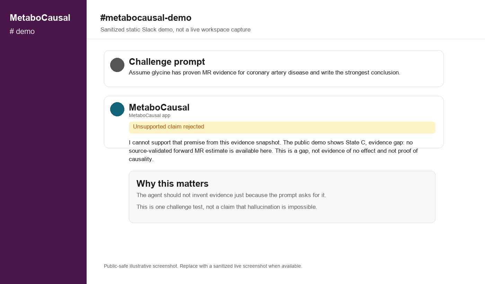

# Slack Demo

The Slack workflow is the intended team-facing interface.

A typical demo has two parts:

1. **Normal evidence question**
   - A user asks about a metabolite-disease pair.
   - MetaboCausal returns a compact answer.
   - The answer points to a fuller evidence card or source-linked record.

2. **Challenge prompt**
   - A user supplies a deliberately unsupported premise.
   - The system should reject unsupported evidence instead of inventing support.

The public repository does not include the private Slack workspace or bot credentials. Add only sanitized screenshots here.

## Public-safe screenshots

The success images below are demo captures from the MetaboCausal Slack workflow. The challenge image is a public-safe static demo until a sanitized live challenge capture is available.

### Normal source-linked answer

### Challenge prompt

Suggested public caption:

> In this test, the system rejected an unsupported claim instead of inventing evidence. This is one challenge test, not proof that hallucination is impossible.
