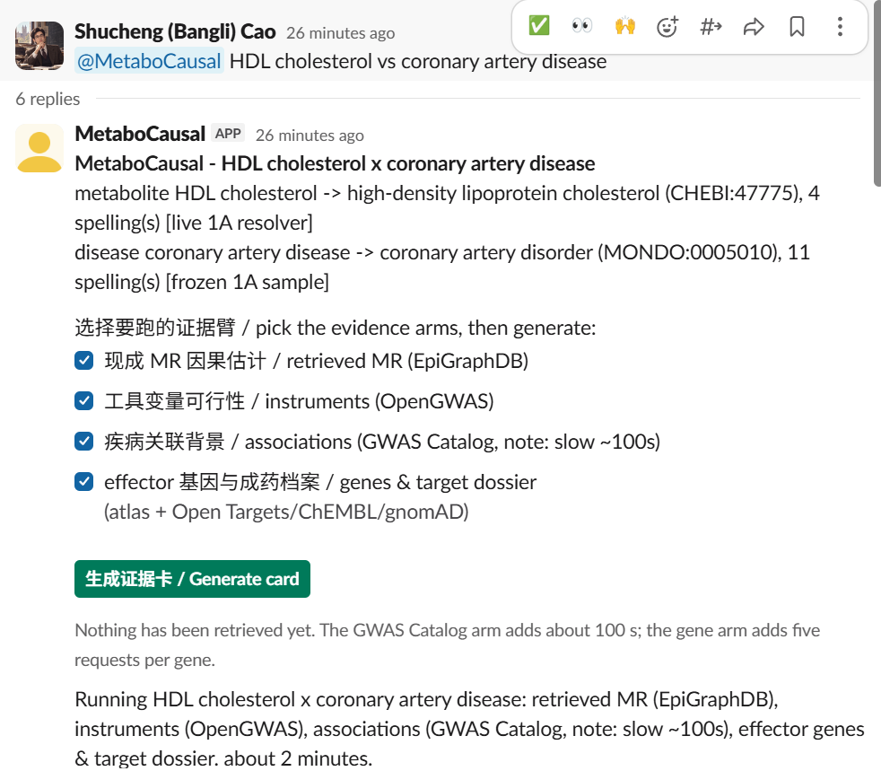
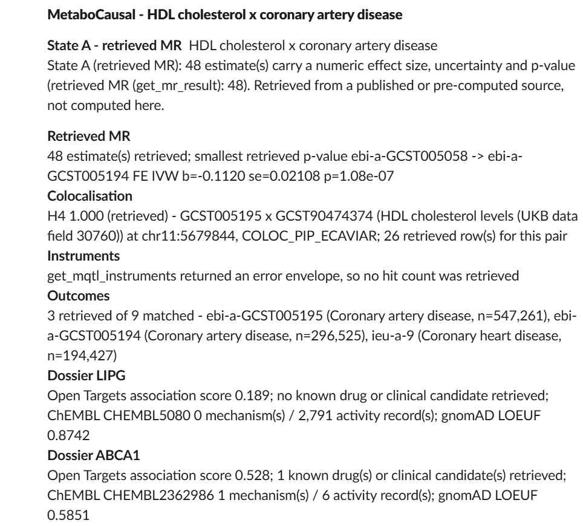
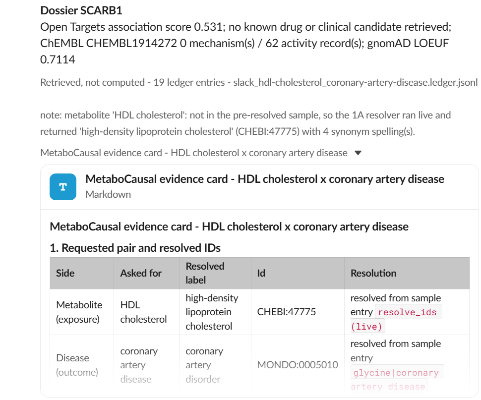
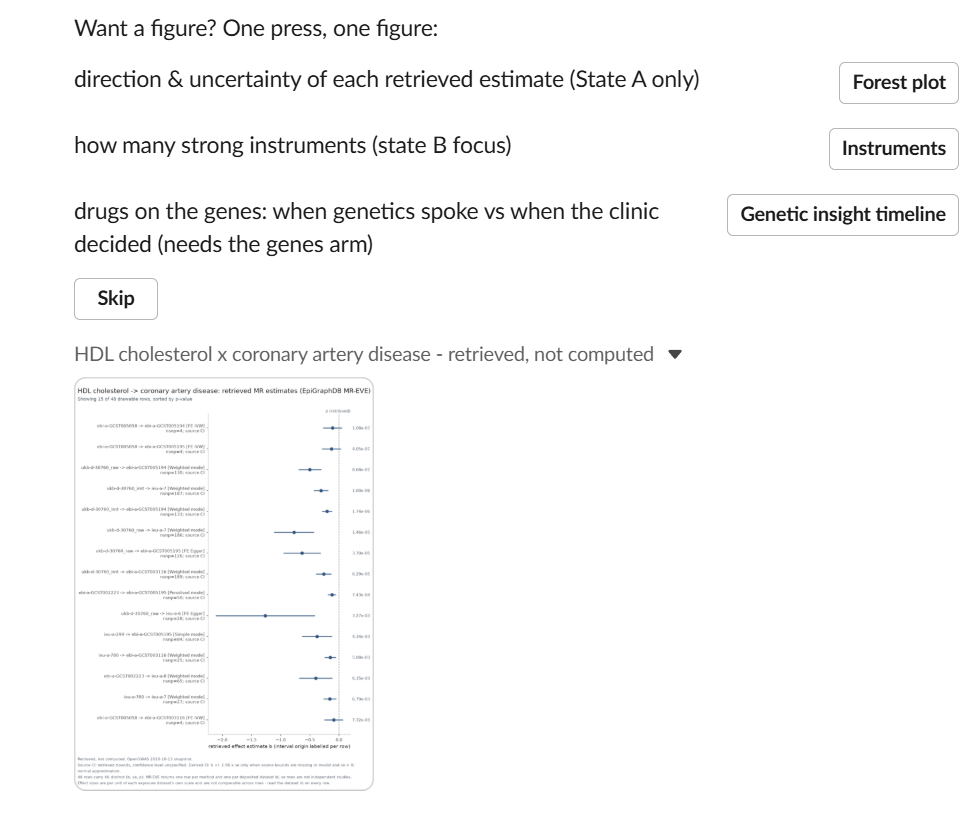
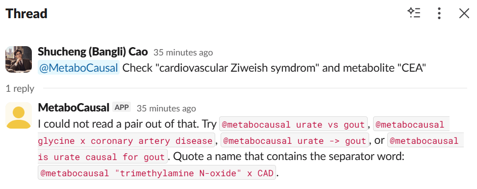

# Slack Demo

The Slack workflow is the intended team-facing interface.

A typical demo has two parts:

1. **Normal evidence question**
   - A user asks about a metabolite-disease pair.
   - MetaboCausal returns a compact answer.
   - The answer points to a fuller evidence card or source-linked record.

2. **Challenge prompt**
   - A user supplies a malformed or unsupported request.
   - The system should reject the request instead of forcing it into an evidence answer.

This repository does not include Slack workspace configuration or bot credentials.

## Demo screenshots

The images below are demo captures from the MetaboCausal Slack workflow.

### Normal source-linked answer

### Challenge prompt

Suggested caption:

> In this test, the system refused to force an unreadable pair into an evidence answer. This is one challenge test, not proof that hallucination is impossible.
